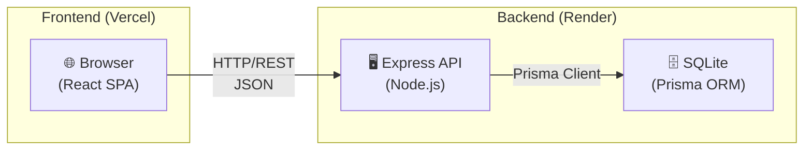
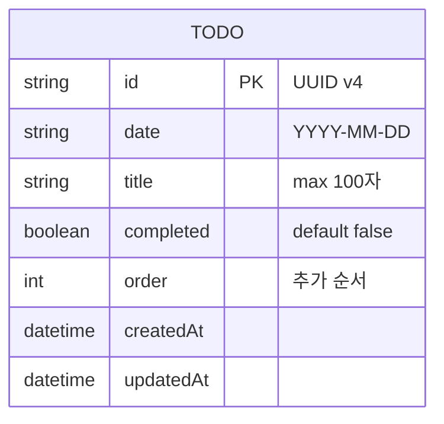
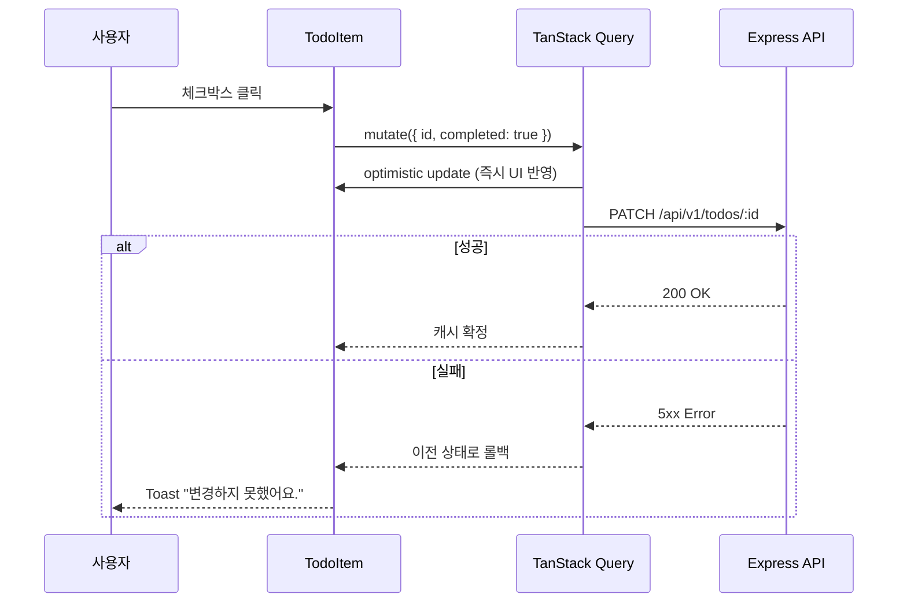
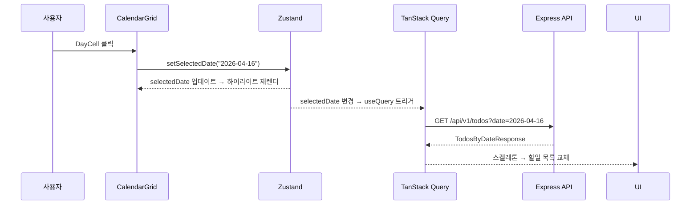

# Tech Spec: Calendar Todo App

---

## 1. 문서 정보

| 항목 | 내용 |
|------|------|
| **작성일** | 2026-04-16 |
| **상태** | Draft |
| **버전** | v0.1 |
| **원문 PRD** | `calendar-todo-prd.md` |
| **작성자** | insang@hansung.ac.kr |

---

## 2. 시스템 아키텍처

### 2-1. 아키텍처 패턴

| 패턴 | 선택 이유 |
|------|-----------|
| **SPA + REST API (분리형)** | Frontend·Backend 책임이 명확히 분리되어 교육 목적에 적합하고, 향후 모바일 클라이언트 추가 시 BE 재사용 가능 |
| **레이어드 아키텍처 (BE)** | Router → Service → Repository 3-레이어로 분리하여 단일 책임 원칙(SRP) 적용, 테스트 용이 |
| **Server State + Client State 분리 (FE)** | 서버 데이터는 TanStack Query로, UI 상태(선택 날짜·편집 모드)는 Zustand로 분리 관리 |

### 2-2. 컴포넌트 구성도



### 2-3. 배포 환경

| 환경 | 호스팅 | 비고 |
|------|--------|------|
| Frontend | Vercel | GitHub 연동 자동 배포 |
| Backend | Render (Free Tier) | Docker 또는 Node 직접 배포 |
| Database | SQLite (BE 서버 내 파일) | 단일 사용자 앱이므로 외부 DB 불필요 |
| CI/CD | GitHub Actions | lint → test → build → deploy 파이프라인 |

---

## 3. 기술 스택

| 분류 | 기술 | 버전 | 선정 이유 |
|------|------|------|-----------|
| **FE 프레임워크** | React | 18.x | 명세 요건, 컴포넌트 모델이 교육에 적합 |
| **FE 빌드 도구** | Vite | 5.x | CRA 대비 10배 빠른 HMR, 설정 최소화 |
| **FE 스타일** | Tailwind CSS | 3.x | 명세 요건, 유틸리티 클래스로 디자인 토큰 일관성 유지 |
| **FE 서버 상태** | TanStack Query | 5.x | 캐싱·재시도·로딩 상태 자동 처리, Optimistic Update 지원 |
| **FE 클라이언트 상태** | Zustand | 4.x | 선택 날짜 등 UI 상태만 관리, Redux 대비 보일러플레이트 없음 |
| **FE 날짜 유틸** | date-fns | 3.x | Tree-shakable, 불변 함수형 API로 side-effect 없음 |
| **BE 런타임** | Node.js | 20.x LTS | 생태계 풍부, FE와 동일 언어로 맥락 전환 비용 없음 |
| **BE 프레임워크** | Express | 4.x | 미니멀 구조로 레이어 아키텍처 학습에 적합 |
| **BE 언어** | TypeScript | 5.x | 타입 안정성, FE와 타입 공유 가능 |
| **ORM** | Prisma | 5.x | 타입 자동 생성, 마이그레이션 관리, 직관적 쿼리 API |
| **DB** | SQLite | 3.x | 별도 DB 서버 불필요, 파일 하나로 즉시 실행 가능 |
| **FE 테스트** | Vitest + React Testing Library | - | Vite 생태계 통합, DOM 기반 행동 테스트 |
| **BE 테스트** | Vitest + Supertest | - | HTTP 레이어까지 통합 테스트 |

---

## 4. 데이터 모델

### 4-1. 엔티티 정의 (TypeScript)

```typescript
// 공유 타입 (packages/shared/types.ts)

export interface Todo {
  id: string;          // UUID v4
  date: string;        // "YYYY-MM-DD" 형식 (ISO 8601 date only)
  title: string;       // 1~100자
  completed: boolean;  // 기본값: false
  order: number;       // 목록 내 순서 (추가 순 오름차순)
  createdAt: string;   // ISO 8601 datetime
  updatedAt: string;   // ISO 8601 datetime
}

export interface CreateTodoRequest {
  date: string;        // "YYYY-MM-DD"
  title: string;       // 1~100자, trim 후 공백 불가
}

export interface UpdateTodoRequest {
  title?: string;      // 제목 수정 시
  completed?: boolean; // 완료 상태 변경 시
}

export interface TodosByDateResponse {
  date: string;
  todos: Todo[];
}

export interface DatesWithTodosResponse {
  dates: string[];     // 할일이 1개 이상인 날짜 목록 ["YYYY-MM-DD", ...]
}
```

### 4-2. Prisma 스키마

```prisma
// prisma/schema.prisma

generator client {
  provider = "prisma-client-js"
}

datasource db {
  provider = "sqlite"
  url      = env("DATABASE_URL") // file:./dev.db
}

model Todo {
  id        String   @id @default(uuid())
  date      String   // "YYYY-MM-DD"
  title     String
  completed Boolean  @default(false)
  order     Int
  createdAt DateTime @default(now())
  updatedAt DateTime @updatedAt

  @@index([date])    // 날짜별 조회 성능 최적화
}
```

### 4-3. ERD



> **설계 결정**: v1은 단일 `Todo` 엔티티만 존재한다. 사용자 인증이 없으므로 `userId` FK는 Out-of-Scope.

---

## 5. API 명세

### 5-1. 공통 규칙

```
Base URL: /api/v1
Content-Type: application/json
```

**공통 성공 응답**
```json
{ "data": <payload>, "error": null }
```

**공통 에러 응답**
```json
{ "data": null, "error": { "code": "ERROR_CODE", "message": "설명" } }
```

**에러 코드 목록**

| code | HTTP | 설명 |
|------|------|------|
| `VALIDATION_ERROR` | 400 | 입력값 검증 실패 |
| `NOT_FOUND` | 404 | 리소스 없음 |
| `INTERNAL_ERROR` | 500 | 서버 내부 오류 |

---

### 5-2. 엔드포인트 목록

| Method | Path | 설명 |
|--------|------|------|
| `GET` | `/api/v1/todos` | 날짜별 할일 목록 조회 |
| `GET` | `/api/v1/todos/dates` | 월별 할일 존재 날짜 목록 조회 (캘린더 인디케이터) |
| `POST` | `/api/v1/todos` | 할일 추가 |
| `PATCH` | `/api/v1/todos/:id` | 할일 수정 (title 또는 completed) |
| `DELETE` | `/api/v1/todos/:id` | 할일 삭제 |

---

### 5-3. 엔드포인트 상세

#### GET `/api/v1/todos?date=YYYY-MM-DD`

날짜별 할일 목록을 `order` 오름차순으로 반환한다.

**Query Parameters**

| 파라미터 | 타입 | 필수 | 설명 |
|---------|------|------|------|
| `date` | string | ✅ | `YYYY-MM-DD` 형식 |

**응답 예시 (200)**
```json
{
  "data": {
    "date": "2026-04-16",
    "todos": [
      {
        "id": "a1b2c3d4-...",
        "date": "2026-04-16",
        "title": "팀 주간 보고서 작성",
        "completed": false,
        "order": 1,
        "createdAt": "2026-04-16T09:00:00.000Z",
        "updatedAt": "2026-04-16T09:00:00.000Z"
      }
    ]
  },
  "error": null
}
```

---

#### GET `/api/v1/todos/dates?month=YYYY-MM`

해당 월에 할일이 1개 이상 등록된 날짜 목록을 반환한다. 캘린더 인디케이터 렌더링에 사용.

**Query Parameters**

| 파라미터 | 타입 | 필수 | 설명 |
|---------|------|------|------|
| `month` | string | ✅ | `YYYY-MM` 형식 |

**응답 예시 (200)**
```json
{
  "data": {
    "dates": ["2026-04-03", "2026-04-10", "2026-04-16"]
  },
  "error": null
}
```

---

#### POST `/api/v1/todos`

새 할일을 추가한다. `order` 값은 해당 날짜의 기존 최대 order + 1로 자동 설정.

**Request Body**
```json
{
  "date": "2026-04-16",
  "title": "디자인 시안 검토"
}
```

**응답 예시 (201)**
```json
{
  "data": {
    "id": "b2c3d4e5-...",
    "date": "2026-04-16",
    "title": "디자인 시안 검토",
    "completed": false,
    "order": 2,
    "createdAt": "2026-04-16T10:30:00.000Z",
    "updatedAt": "2026-04-16T10:30:00.000Z"
  },
  "error": null
}
```

**검증 규칙**
- `date`: 필수, `YYYY-MM-DD` 형식
- `title`: 필수, trim 후 1~100자, 공백 전용 불가

---

#### PATCH `/api/v1/todos/:id`

할일의 제목 또는 완료 상태를 수정한다. 두 필드 모두 선택적이며 하나 이상 전송해야 한다.

**Path Parameters**

| 파라미터 | 타입 | 설명 |
|---------|------|------|
| `id` | string | Todo UUID |

**Request Body (부분 업데이트 가능)**
```json
{ "title": "수정된 제목" }
// 또는
{ "completed": true }
// 또는
{ "title": "수정된 제목", "completed": true }
```

**응답 예시 (200)**
```json
{
  "data": {
    "id": "b2c3d4e5-...",
    "date": "2026-04-16",
    "title": "수정된 제목",
    "completed": true,
    "order": 2,
    "createdAt": "2026-04-16T10:30:00.000Z",
    "updatedAt": "2026-04-16T11:00:00.000Z"
  },
  "error": null
}
```

---

#### DELETE `/api/v1/todos/:id`

할일을 영구 삭제한다.

**Path Parameters**

| 파라미터 | 타입 | 설명 |
|---------|------|------|
| `id` | string | Todo UUID |

**응답 예시 (200)**
```json
{
  "data": { "id": "b2c3d4e5-..." },
  "error": null
}
```

---

## 6. 상세 기능 명세

### 6-1. Frontend

#### 컴포넌트 트리

```
App
├── CalendarPanel                   # 좌측 (데스크탑) / 상단 (모바일)
│   ├── MonthNavigation             # "< 2026년 4월 >" 이동 버튼
│   ├── WeekdayHeader               # 일 월 화 수 목 금 토
│   └── CalendarGrid
│       └── DayCell (×42)           # 날짜 셀, 인디케이터 점 포함
└── TodoPanel                       # 우측 (데스크탑) / 하단 (모바일)
    ├── TodoPanelHeader             # "4월 16일 수요일" 타이틀
    ├── TodoInput                   # 할일 입력 필드 + 추가 버튼
    ├── TodoList
    │   ├── SkeletonLoader          # 로딩 중 스켈레톤
    │   ├── EmptyState              # 할일 없음 안내
    │   ├── ErrorState              # 오류 + 재시도 버튼
    │   └── TodoItem (×N)
    │       ├── Checkbox            # 완료 토글
    │       ├── TodoTitle           # 읽기 / 인라인 편집 모드
    │       └── ActionButtons       # hover 시 표시 (수정·삭제)
    └── Toast                       # 오류 메시지 토스트 (전역)
```

#### 상태 관리 분리

| 상태 | 관리 주체 | 이유 |
|------|-----------|------|
| 선택된 날짜 (`selectedDate`) | Zustand | 캘린더↔할일 패널 간 공유 UI 상태 |
| 현재 표시 월 (`currentMonth`) | Zustand | 월 이동 시 즉각 반응 필요 |
| 편집 중인 항목 ID (`editingId`) | TodoItem 로컬 state | 다른 컴포넌트와 무관한 순수 UI 상태 |
| 할일 목록 / 인디케이터 날짜 | TanStack Query | 서버 데이터 캐싱·재시도·Optimistic Update |

#### 핵심 쿼리 키 설계

```typescript
// queryKeys.ts
export const queryKeys = {
  todos: (date: string) => ['todos', date] as const,
  datesWithTodos: (month: string) => ['datesWithTodos', month] as const,
};
```

#### Optimistic Update — 완료 체크 시퀀스



#### 날짜 선택 시퀀스



#### 인라인 편집 상태 전환

```
읽기 모드 →[클릭]→ 편집 모드(input focus)
편집 모드 →[Enter / 저장버튼]→ PATCH API 호출 → 읽기 모드
편집 모드 →[Esc / 취소버튼]→ 읽기 모드 (값 복원)
```

#### 엣지 케이스 처리 요약

| 상황 | 처리 방식 |
|------|-----------|
| title trim 후 빈 문자열 | 추가 버튼 비활성화, Enter 무시 |
| 편집 중 title 공백만 | 저장 버튼 비활성화 |
| API 오류 (추가/수정/삭제) | Toast 메시지 표시 + Optimistic rollback |
| 월 이동 시 인디케이터 로딩 | 스켈레톤 점(점) 표시 |

---

### 6-2. Backend

#### 레이어 책임 분리

```
┌─────────────────────────────────────────┐
│  Router Layer  (routes/todo.routes.ts)  │  HTTP 파싱, 응답 직렬화
├─────────────────────────────────────────┤
│  Service Layer (services/todo.service)  │  비즈니스 로직, 유효성 검증
├─────────────────────────────────────────┤
│  Repository Layer (repos/todo.repo.ts)  │  Prisma 쿼리, DB 접근
└─────────────────────────────────────────┘
```

#### 디렉토리 구조

```
backend/
├── src/
│   ├── routes/
│   │   └── todo.routes.ts
│   ├── services/
│   │   └── todo.service.ts
│   ├── repositories/
│   │   └── todo.repository.ts
│   ├── middlewares/
│   │   ├── errorHandler.ts    # 전역 에러 핸들러
│   │   └── validate.ts        # Zod 입력 검증 미들웨어
│   ├── schemas/
│   │   └── todo.schema.ts     # Zod 스키마 정의
│   └── app.ts
├── prisma/
│   ├── schema.prisma
│   └── migrations/
└── package.json
```

#### 핵심 비즈니스 로직 (Service)

```typescript
// todo.service.ts — 설명용 의사코드

async createTodo(date: string, title: string): Promise<Todo> {
  const trimmed = title.trim();
  if (!trimmed || trimmed.length > 100) throw ValidationError;

  const maxOrder = await repo.getMaxOrder(date); // 해당 날짜 최대 order 조회
  return repo.create({ date, title: trimmed, order: maxOrder + 1 });
}

async getDatesWithTodos(month: string): Promise<string[]> {
  // "YYYY-MM" → LIKE 'YYYY-MM-%' 쿼리로 해당 월의 date 목록 조회
  // 중복 제거 후 정렬하여 반환
}
```

#### 성능 고려사항

- `Todo.date` 컬럼에 인덱스 적용 (Prisma `@@index([date])`) → 날짜 필터 O(log n)
- `GET /todos/dates` 는 DB에서 `SELECT DISTINCT date` 로 집계, 애플리케이션 레이어 루프 없음

#### 보안 고려사항

- 모든 입력값은 Zod 스키마로 검증 후 서비스 레이어 진입
- CORS: 프로덕션 환경에서는 Vercel FE 도메인만 허용
- SQL Injection: Prisma Parameterized Query로 원천 방지
- title 100자 초과 시 `VALIDATION_ERROR` 400 반환

---

## 7. UI/UX 스타일 가이드

### 7-1. 디자인 토큰 (Tailwind 커스텀 확장)

```javascript
// tailwind.config.js
theme: {
  extend: {
    colors: {
      primary:   '#4F46E5',   // 인디고 — 선택 날짜 배경, CTA 버튼
      success:   '#10B981',   // 에메랄드 — 완료 체크박스
      danger:    '#EF4444',   // 레드 — 삭제 버튼 hover
      neutral: {
        50:  '#F9FAFB',       // 캘린더 배경
        200: '#E5E7EB',       // 구분선, 스켈레톤
        500: '#6B7280',       // 서브 텍스트, 완료 항목
        900: '#111827',       // 주 텍스트
      }
    }
  }
}
```

### 7-2. 타이포그래피

| 용도 | Tailwind 클래스 |
|------|----------------|
| 월/연도 헤더 | `text-xl font-semibold text-neutral-900` |
| 날짜 숫자 | `text-sm font-medium` |
| 선택 날짜 패널 타이틀 | `text-lg font-semibold text-neutral-900` |
| 할일 제목 (활성) | `text-sm text-neutral-900` |
| 할일 제목 (완료) | `text-sm text-neutral-500 line-through` |
| 안내 문구 | `text-sm text-neutral-500` |

### 7-3. 공통 컴포넌트 사양

**DayCell 상태별 스타일**

| 상태 | 스타일 |
|------|--------|
| 기본 | `hover:bg-neutral-100 rounded-full` |
| 오늘 | `text-primary font-bold` |
| 선택됨 | `bg-primary text-white rounded-full` |
| 인디케이터 있음 | 날짜 아래 `w-1 h-1 bg-primary rounded-full` 점 표시 |

**TodoItem 상태별 스타일**

| 상태 | 스타일 |
|------|--------|
| 기본 | `flex items-center gap-2 py-2 px-3 rounded-lg hover:bg-neutral-50` |
| 완료 | 제목에 `line-through text-neutral-500` |
| 편집 중 | 제목을 `<input>` 으로 교체, `border-b border-primary focus:outline-none` |
| 액션 버튼 | `group-hover:opacity-100 opacity-0 transition-opacity` |

**SkeletonLoader**

```
캘린더: 6×7 그리드 회색 원형 플레이스홀더
할일 목록: 3개 회색 직사각형 바 (animate-pulse)
```

**Toast**

- 위치: 화면 우하단 고정
- 자동 사라짐: 4초
- 스타일: `bg-neutral-900 text-white rounded-lg px-4 py-2 shadow-lg`

### 7-4. 반응형 브레이크포인트

| 화면 | 레이아웃 |
|------|---------|
| `< 768px` (모바일) | 캘린더 상단 / 할일 패널 하단 (세로 스택) |
| `≥ 768px` (태블릿+) | 캘린더 좌측 40% / 할일 패널 우측 60% (가로 분할) |

### 7-5. 접근성

- 체크박스: `aria-label="할일 완료 체크"` 적용
- DayCell: `aria-selected`, `aria-label="2026년 4월 16일"` 적용
- 오류 메시지: `role="alert"` 적용
- 키보드: Tab 탐색, Enter 확인, Esc 취소 전 기능 지원

---

## 8. 개발 마일스톤

### Phase 1 — 기반 구축 (예상: 2일)

- [ ] Frontend: Vite + React + Tailwind CSS 프로젝트 초기화
- [ ] Backend: Express + TypeScript + Prisma 프로젝트 초기화
- [ ] DB: SQLite 연결 및 Todo 스키마 마이그레이션
- [ ] CI: GitHub Actions — lint + 타입체크 파이프라인 구성

### Phase 2 — 핵심 기능 구현 (예상: 4일)

- [ ] BE: `GET /todos`, `POST /todos`, `PATCH /todos/:id`, `DELETE /todos/:id` API 구현
- [ ] BE: `GET /todos/dates` API 구현
- [ ] FE: CalendarPanel (월 이동 + DayCell 선택) 구현
- [ ] FE: TodoPanel (목록 조회 + TodoItem CRUD) 구현
- [ ] FE: TanStack Query 연동 + Optimistic Update 적용

### Phase 3 — UI 완성 및 엣지 케이스 처리 (예상: 2일)

- [ ] FE: SkeletonLoader / EmptyState / ErrorState 구현
- [ ] FE: Toast 컴포넌트 구현
- [ ] FE: 반응형 레이아웃 (모바일 브레이크포인트) 적용
- [ ] FE: 접근성 속성 (`aria-*`) 적용
- [ ] FE/BE: 엣지 케이스 검증 (공백 title, 404, 500 처리)

### Phase 4 — 안정화 및 배포 (예상: 2일)

- [ ] BE: 단위 테스트 (Service 레이어) + 통합 테스트 (Supertest)
- [ ] FE: 컴포넌트 테스트 (React Testing Library — DayCell, TodoItem)
- [ ] CI: GitHub Actions — test + build 파이프라인 확장
- [ ] CD: Vercel(FE) + Render(BE) 자동 배포 설정
- [ ] 성능 검증: Lighthouse — 첫 로딩 3초 이하 확인

---

## 부록

### A. 용어 정의

| 용어 | 정의 |
|------|------|
| `date` | `YYYY-MM-DD` 형식의 날짜 문자열 (타임존 없음, 로컬 날짜 기준) |
| `order` | 동일 날짜 내 할일의 표시 순서. 추가 시 자동 증가 |
| Optimistic Update | API 응답 전에 UI를 먼저 변경하고, 실패 시 롤백하는 UX 패턴 |
| Skeleton | 콘텐츠 로딩 중 실제 레이아웃 크기를 유지하는 회색 플레이스홀더 |

### B. 미결 사항 (Open Questions)

| # | 질문 | 영향 |
|---|------|------|
| 1 | 브라우저 새로고침 시 선택 날짜 유지 여부 (URL 파라미터 vs localStorage) | FE 라우팅 설계 |
| 2 | 서버 배포 후 SQLite 파일 영속성 보장 방안 (Render ephemeral storage 이슈) | 추후 PostgreSQL 마이그레이션 검토 |
| 3 | 사용자 인증 도입 시점 (v2에서 Auth 추가 시 `userId` FK 추가 필요) | DB 스키마 확장성 |

### C. 변경 이력

| 버전 | 날짜 | 변경 내용 |
|------|------|-----------|
| v0.1 | 2026-04-16 | 최초 작성 |
